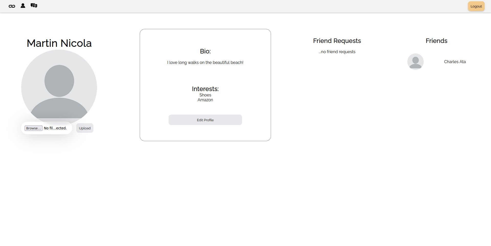
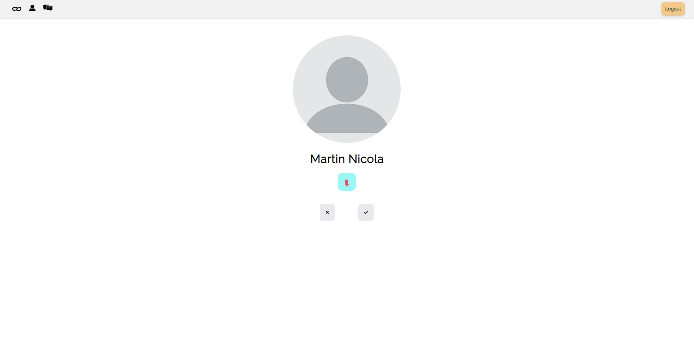

# **Friend.ly**

## General Overview

Friend.ly is a social media app designed for making friends. It has mechanics loosely based on Tinder.

Users will "swipe right" or "swipe left" on other users by hitting a checkmark or "X", respectively. At that point a friend request will be sent.

Once a friend request is accepted, the receiving user can choose to accept it. Once the friend request is accepted, users can then converse with each other.

## Screenshots

)

## Technologies Used

- Express.js
- React.js
- Node.js
- AWS S3
- Railway Deployment
- JWT
- CSS
- Bootstrap
- SocketIO
- Vanilla JavaScript

## Complete Code

The code used in this repository is strictly for deployment and only contains the backend along with the React build folder. For the full code, go [here](https://github.com/codewithmarty/friendly-revised).

## Try it out

The app is available and ready to try [here](https://friend-ly.up.railway.app/)

## Future Work

- **Decline Friend Requests**: In the current application, users accept friend requests, but they cannot decline friend requests. This will simply involve a deletion of the friendship document in the database so shouldn't be difficult to implement.
- **Unfriend people**: I'm missing the unfriending of people. This is a deletion of the friendship document in the database as well as a deletion of any messages they've sent or have been sent to them.
- **Delete account**: I'd like to implement a deletion of account in the database. This means removing the user document, the messages associated with that user and any friendships they've made.
- **View Friend Profiles**: This is an important feature that is not part of the minimum viable product. You should be able to view another user's profile. A user can view their own profile, just not the profile of their friends. Some logic needs to be added to the current Profile component to render someone else's data and not the currently logged in user.